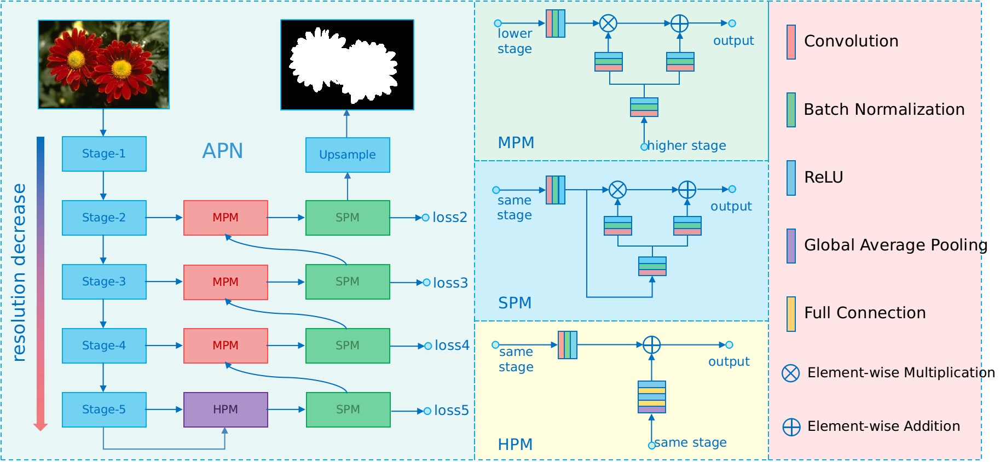
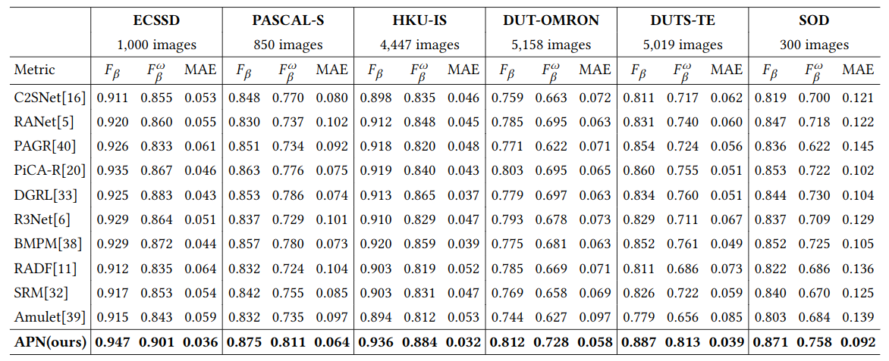
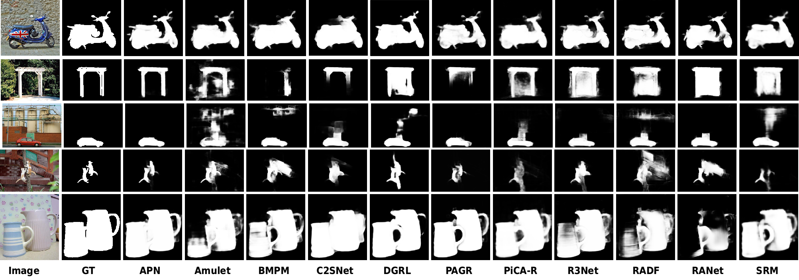

# Active Perception Network for Salient Object Detection

## Introduction
To get better saliency maps for salient object detection, recent methods fuse features from different levels of convolutional neural networks and have achieved remarkable progress. However, the differences between different feature levels bring difficulties to the fusion process, thus it may lead to unsatisfactory saliency predictions. To address this issue, we propose Active Perception Network (APN) to enhance inter-feature consistency for salient object detection. First, Mutual Projection Module (MPM) is developed to fuse different features, which uses high-level features as guided information to extract complementary components from low-level features, and can suppress background noises and improve semantic consistency. Self Projection Module (SPM) is designed to further refine the fused features, which can be considered as the extended version of residual connection. Features that pass through SPM can produce more accurate saliency maps. Finally, we propose Head Projection Module (HPM) to aggregate global information, which brings strong semantic consistency to the whole network. Comprehensive experiments on six benchmark datasets demonstrate that the proposed method outperforms the state-of-the-art approaches on different evaluation metrics.


## Prerequisites
- [Python 3.5](https://www.python.org/)
- [Pytorch 1.0](http://pytorch.org/)
- [OpenCV](https://opencv.org/)
- [Numpy](https://numpy.org/)
- [TensorboardX](https://github.com/lanpa/tensorboardX)
- [Apex](https://github.com/NVIDIA/apex)


## Clone repository

```shell
git clone git@github.com:weijun88/APN.git
cd APN/
```

## Download dataset

Download the following datasets and unzip them into `data` folder

- [SOD](http://elderlab.yorku.ca/SOD/)
- [PASCAL-S](http://cbi.gatech.edu/salobj/)
- [ECSSD](http://www.cse.cuhk.edu.hk/leojia/projects/hsaliency/dataset.html)
- [HKU-IS](https://i.cs.hku.hk/~gbli/deep_saliency.html)
- [DUT-OMRON](http://saliencydetection.net/dut-omron/)
- [DUTS](http://saliencydetection.net/duts/)

## Download model

If you want to test the performance of APN, please download the following [model](https://drive.google.com/open?id=1zKogcTuA9JA5v7PfnArVyTPTaOw1ZqDG) into `out` folder. If you want to train your own model, please download [resnet50]('https://download.pytorch.org/models/resnet50-19c8e357.pth') into `out` folder as pretrained model

## Training

```shell
    cd src/
    python3 train.py
```
- `ResNet-50` is used as the backbone of APN and `DUTS-TR` is used to train the model
- `batch=64`, `lr=0.1`, `momen=0.9`, `decay=5e-4`, `epoch=32`
- Warm-up and linear decay strategies are used to change the learning rate (`lr`)
- After training, the result models will be saved in `out` folder and log files will be saved in `log` folder

## Testing

```shell
    python3 test.py
```
- After testing, saliency maps of `SOD`, `PASCAL-S`, `ECSSD`, `HKU-IS`, `DUT-OMRON`, `DUTS-TE` will be saved in `eval/APN/` folder in `*.png` folder.

## Evaluation
- To evaluate the performace of APN, please use MATLAB to run `main.m`
- Quantitative comparisons 


- Qualitative comparisons 


